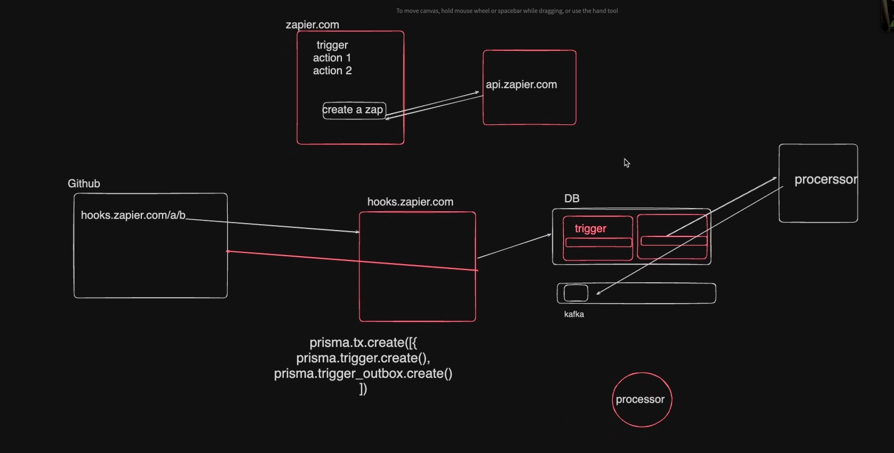

# 🚀 Zapier-Lite: A Transactional Outbox Automation Platform

**Zapier-Lite** is a simplified automation platform inspired by Zapier. It focuses on ensuring atomicity in workflows using a **transactional outbox pattern**. The platform supports **webhooks**, **email actions**, and **Solana-based bounty payouts**, powered by **Kafka** for robust event-driven architecture.

---


## 🖼️ System Architecture Diagram

_The diagram illustrating the high-level architecture of the system._


## ✨ Key Features

- **Webhook Triggers**:  
  Listen for events and initiate workflows automatically.

- **Email Actions**:  
  Automate email notifications with ease.

- **Solana Payout Actions**:  
  Transfer bounties or complete transactions using the Solana blockchain.

- **Transactional Outbox Pattern**:  
  Ensures atomicity of operations by decoupling database writes and event processing.

- **Kafka Integration**:  
  Efficiently process and manage event queues.

---

## 🏗️ Architecture Overview

### 1. **Transactional Outbox Pattern**
- **Trigger Schema**: Stores trigger information (e.g., webhook events).
- **Outbox Schema**: Stores transactional records to be processed.
- **Processor**: Pulls records from the outbox schema and pushes them to Kafka/Redis queues for downstream actions.

### 2. **Workflow Actions**
- **Email**: Trigger email notifications based on events.
- **Solana Send**: Trigger Solana bounty payouts via blockchain.

---

## 🛠️ Installation

### Prerequisites

- **Node.js**  
- **Docker** (for PostgreSQL and Kafka)  
- **Postman** (for API testing)

### Steps

1. **Install Dependencies**:  
   ```bash
   npm install express prisma
   npx prisma init
   ```

2. **Set Up Database**:  
   ```bash
   docker run -p 5432:5432 -e POSTGRES_PASSWORD=mysecretpassword postgres
   npx prisma migrate dev --name init
   npx prisma generate
   ```

3. **Run the Application**:  
   ```bash
   npm start
   ```

---

## 🗃️ Database Structure

- **Trigger Schema**: Captures incoming events (e.g., webhook triggers).
- **Outbox Schema**: Stores transactional data for processing.

---

## 🔄 Processor

The **processor** pulls records from the `zapierOutbox` schema, processes them, and sends them to Kafka in batches. Once processed, records are deleted from the outbox.

### Run Kafka Locally

1. Start Kafka:  
   ```bash
   docker run -p 9092:9092 apache/kafka:3.7.1
   ```

2. Access Kafka Container:  
   ```bash
   docker exec -it <container-id> /bin/bash
   ```

3. Create a Kafka Topic:  
   ```bash
   cd /opt/kafka/bin
   ./kafka-topics.sh --create --topic zapier-event --bootstrap-server localhost:9092
   ```

4. Consume Messages:  
   ```bash
   ./kafka-console-consumer.sh --topic zapier-event --from-beginning --bootstrap-server localhost:9092
   ```

---

## 🔬 Testing

### Available Actions
- **Email**: Send notifications.
- **Solana Send**: Transfer bounties.

### Available Triggers
- **Webhook**: Listen for external events.

### API Testing (Postman)
- **Zap**: Trigger actions with a unique zap ID.
- **Trigger**: Initialize workflows with the `zapId` and available triggers (e.g., webhook).

---

## 📚 Notes

- **Atomicity**: Ensure operations maintain atomicity across services.
- **Batch Processing**: Send records in batches to optimize performance.
- **Monorepo**: Copy over the same database for better maintainability.

---

## 🤝 Contributing

1. Fork the repository.  
2. Create a branch: `git checkout -b feature/your-feature-name`.  
3. Commit your changes: `git commit -m "Add feature"`.  
4. Push the branch: `git push origin feature/your-feature-name`.  
5. Submit a pull request.

---

## TODOS
1. Send the user a verification email, make them verify email before signing them up
 - Add a new field in the DB called verify, and only if user is verified should they be ablt to login
2. Let user reset their password through email
3. Solana reconcilliation side quest - If the users solana txn fails/takes a long time/is submitted to the blockchain, but your node goes down. What happens then? how can u prevent sending them money twice when the worker comes back up
4. Use react-flow for the UI, make it prettier
 - If you are using react-flow, can you create parallel actions.
